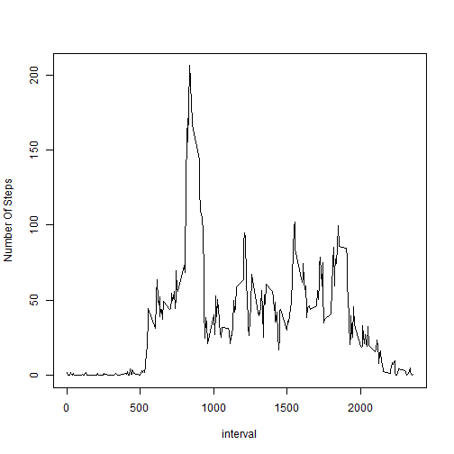
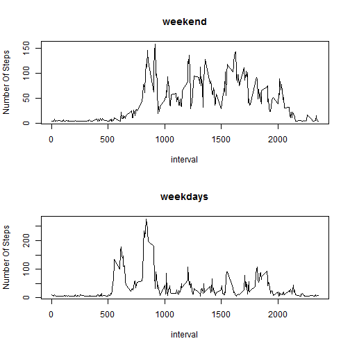

# Reproducible Research: Peer Assessment 1  


## Loading and preprocessing the data  


```r
r<-read.csv("./activity.csv")
head(r)
```

```
##   steps       date interval
## 1    NA 2012-10-01        0
## 2    NA 2012-10-01        5
## 3    NA 2012-10-01       10
## 4    NA 2012-10-01       15
## 5    NA 2012-10-01       20
## 6    NA 2012-10-01       25
```

## What is mean total number of steps taken per day?  

**first to make variable t being the date and its corresponding total steps number**

```r
t<-tapply(r$steps,r$date,FUN = sum,simplify = TRUE,na.rm=TRUE)
```

###the histogram is as belows


```r
barplot(t)
```

 

###the mean total number of steps taken per day is as belows:
 

```r
mean(t,na.rm = TRUE)
```

```
## [1] 9354
```

###the median total number of steps taken per day is as belows:


```r
median(t,na.rm=TRUE)
```

```
## [1] 10395
```

## What is the average daily activity pattern?  

**first get t2 being the intervals with corresponding averaged steps**


```r
t2<-tapply(r$steps,r$interval,FUN=mean,na.rm=TRUE)
```

###then the time series plot is as below: 

(notice that for x axis , the hundreds and thousands digits stand for the hour of the day ,the ones and tens digits stand for the minutes of the hour)


```r
plot(names(t2),t2,type="l",xlab="interval",ylab="Number Of Steps")
```

 

**Which 5-minute interval, on average across all the days in the dataset, contains the maximum number of steps?**


```r
which.max(t2)
```

```
## 835 
## 104
```

so the maximum number is the **104th** interval of the day , and the interval with the indentifier as **835**

## Imputing missing values  

total number of missing values is as belows:


```r
sum(is.na(r))
```

```
## [1] 2304
```

numbers of missing values per column is as belows:


```r
sum(is.na(r[,1]))
```

```
## [1] 2304
```

```r
sum(is.na(r[,2]))
```

```
## [1] 0
```

```r
sum(is.na(r[,3]))
```

```
## [1] 0
```

so only the first colum contains missing values

a strategy to fill the missing value i took is using the mean of the whole column:


```r
r2<-r
h<-is.na(r$steps)
r2[h,"steps"]<-mean(r$steps,na.rm=TRUE)
```
so the  histogram of the total number of steps taken each day is :


```r
ft<-tapply(r2$steps,r2$date,FUN = sum,simplify = TRUE)
barplot(ft)
```

 

and the mean and median of the  total number of steps taken per day is:


```r
mean(ft)
```

```
## [1] 10766
```

```r
median(ft)
```

```
## [1] 10766
```

the differences between the original one and the filled one is :


```r
par(mfrow=c(2,1))
barplot(t,main="original")
barplot(ft,main="filled")
```

 

```r
mean(t)
```

```
## [1] 9354
```

```r
mean(ft)
```

```
## [1] 10766
```

```r
median(t)
```

```
## [1] 10395
```

```r
median(ft)
```

```
## [1] 10766
```

so filling the missing value does have an impact , in my strategy, it increase the estimate

## Are there differences in activity patterns between weekdays and weekends?


```r
hdate<-as.Date(r2$date,"%Y-%m-%d")
hdate<-weekdays(hdate)
h<-grep("^(Sa|Su)",hdate)
th<-rep(TRUE,length(h))
th[h]<-FALSE
r2wd<-r2[!th,]
r2wy<-r2[th,]
r2wdt2<-tapply(r2wd$steps,r2wd$interval,FUN=mean)
r2wyt2<-tapply(r2wy$steps,r2wy$interval,FUN=mean)
par(mfrow=c(2,1))
plot(names(r2wdt2),r2wdt2,type="l",main="weekend",xlab="interval",ylab="Number Of Steps")
plot(names(r2wyt2),r2wyt2,type="l",main="weekdays",xlab="interval",ylab="Number Of Steps")
```

 
